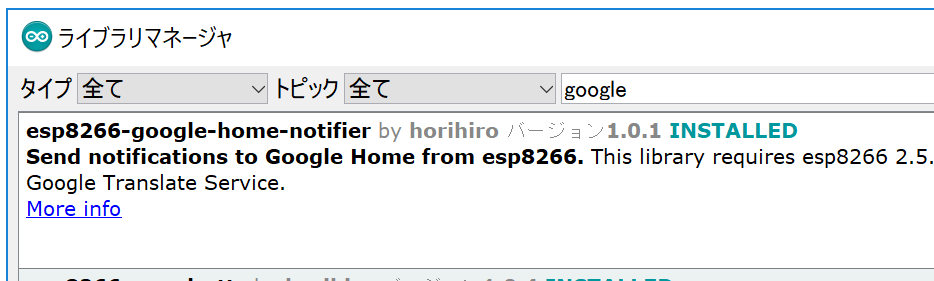

# esp8266-google-home-notifier
Send notifications to Google Home from esp8266.

This library depends on Google Translate Service.

[This](https://qiita.com/horihiro/items/4ab0edf415916a2cd542) is the Japanese document on [Qiita.com](https://qiita.com/);

## Install
This library can be installed from the Library Manager on Arduino IDE



## Requirement
- Arduino board 
  - esp8266
  - esp32<br>
    (note: 1.0.2 and later, and 1.0.4 requires [83810fa](https://github.com/espressif/arduino-esp32/tree/83810fa1563f77145272583e36dfb076d3a92018)  or later of [arduino-esp32](https://github.com/espressif/arduino-esp32))
- [esp8266-google-tts](https://github.com/horihiro/esp8266-google-tts) <br>
  [download from Library Manager](https://github.com/horihiro/esp8266-google-tts/blob/master/README.md#install) of Arduino IDE

- (only for ver 1.0.1 and earlier) Latest ESP8266mDNS
  - download [ESP8266mDNS.cpp](https://github.com/mblythe86/Arduino/blob/master/libraries/ESP8266mDNS/ESP8266mDNS.cpp)/[.h](https://github.com/mblythe86/Arduino/blob/master/libraries/ESP8266mDNS/ESP8266mDNS.h) to  `$LIBRARIES_DIR/esp8266-google-home-notifier/src/` and restart Arduino IDE, like below structure. <br>
  ```
  $LIBRARIES_DIR
    └── esp8266-google-home-notifier/
        ├── LICENSE
        ├── README.md
        :
        └── src/
            ├── ESP8266mDNS.cpp  # <- additional file
            ├── ESP8266mDNS.h    # <- additional file
            :
            ├── esp8266-google-home-notifier.cpp
            └── esp8266-google-home-notifier.h
  ```
  or
  - ~~use [Arduino Core for ESP8266](https://github.com/esp8266/Arduino/) **2.5.0**, which will [merge ESP8266mDNS.cpp/.h](https://github.com/esp8266/Arduino/pull/3107), or later.~~<br>
  -> The PR wasn't merged, so MDNS handling in this library should be fix under ESP8266 cor 2.5.0 or later.

## Usage
### Simple for esp8266/32
```
#ifdef ARDUINO_ARCH_ESP8266
#include <ESP8266WiFi.h>
#endif

#ifdef ARDUINO_ARCH_ESP32
#include <WiFi.h>
#endif
#include <esp8266-google-home-notifier.h>

const char* ssid     = "<REPLASE_YOUR_WIFI_SSID>";
const char* password = "<REPLASE_YOUR_WIFI_PASSWORD>";

GoogleHomeNotifier ghn;

void setup() {
  // put your setup code here, to run once:
  Serial.begin(115200);
  Serial.println("");
  Serial.print("connecting to Wi-Fi");
  WiFi.mode(WIFI_STA);
  WiFi.begin(ssid, password);

  while (WiFi.status() != WL_CONNECTED) {
    delay(250);
    Serial.print(".");
  }
  Serial.println("");
  Serial.println("connected.");
  Serial.print("IP address: ");
  Serial.println(WiFi.localIP());  //Print the local IP
  
  const char displayName[] = "Family Room";

  Serial.println("connecting to Google Home...");
  if (ghn.device(displayName, "en") != true) {
    Serial.println(ghn.getLastError());
    return;
  }
  Serial.print("found Google Home(");
  Serial.print(ghn.getIPAddress());
  Serial.print(":");
  Serial.print(ghn.getPort());
  Serial.println(")");
  
  if (ghn.notify("Hello, World!") != true) {
    Serial.println(ghn.getLastError());
    return;
  }
  Serial.println("Done.");
}

void loop() {
  // put your main code here, to run repeatedly:

}
```

### Notification Server for esp8266
```
#include <ESP8266WiFi.h>
#include <ESP8266WebServer.h>
#include <esp8266-google-home-notifier.h>

const char* ssid     = "<REPLASE_YOUR_WIFI_SSID>";
const char* password = "<REPLASE_YOUR_WIFI_PASSWORD>";

ESP8266WebServer server(80);
GoogleHomeNotifier ghn;

void setup() {
  // put your setup code here, to run once:
  Serial.begin(115200);
  Serial.println("");
  Serial.print("connecting to Wi-Fi");
  WiFi.mode(WIFI_STA);
  WiFi.begin(ssid, password);

  while (WiFi.status() != WL_CONNECTED) {
    delay(250);
    Serial.print(".");
  }
  Serial.println("");
  Serial.println("connected.");
  Serial.print("IP address: ");
  Serial.println(WiFi.localIP());  //Print the local IP
  
  const char displayName[] = "Family Room";

  Serial.println("connecting to Google Home...");
  if (ghn.device(displayName, "en") != true) {
    Serial.println(ghn.getLastError());
    return;
  }
  Serial.print("found Google Home(");
  Serial.print(ghn.getIPAddress());
  Serial.print(":");
  Serial.print(ghn.getPort());
  Serial.println(")");
  
  server.on("/speech", handleSpeechPath);
  server.on("/", handleRootPath);
  server.begin();
 }

void handleSpeechPath() {
  String phrase = server.arg("phrase");
  if (phrase == "") {
    server.send(401, "text / plain", "query 'phrase' is not found");
    return;
  }
  if (ghn.notify(phrase.c_str()) != true) {
    Serial.println(ghn.getLastError());
    server.send(500, "text / plain", ghn.getLastError());
    return;
  }
  server.send(200, "text / plain", "OK");
}

void handleRootPath() {
  server.send(200, "text/html", "<html><head></head><body><input type=\"text\"><button>speech</button><script>var d = document;d.querySelector('button').addEventListener('click',function(){xhr = new XMLHttpRequest();xhr.open('GET','/speech?phrase='+encodeURIComponent(d.querySelector('input').value));xhr.send();});</script></body></html>");
}

void loop() {
  // put your main code here, to run repeatedly:
  server.handleClient();
}
```
